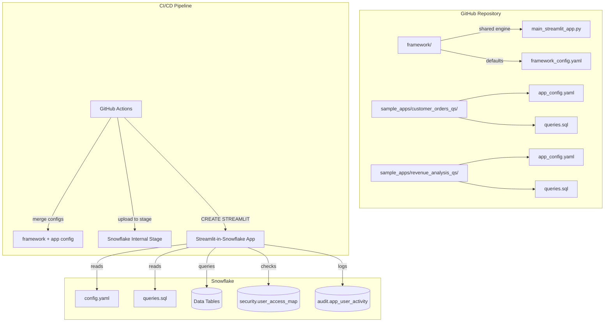

# App-as-Code: Metadata-Driven Streamlit Framework for Snowflake

> Build unlimited Streamlit-in-Snowflake apps from **YAML + SQL** — no per-app Python code.

## What Is This?

A framework engine that reads a YAML config and a SQL template, then renders a complete interactive Streamlit application — filters, query execution, pagination, export, audit logging, row-level security, and more.

```
app_config.yaml  ─→ ┐
queries.sql      ─→ ├─→  main_streamlit_app.py  ─→  Live Streamlit App
framework_config ─→ ┘
```

**One engine. Unlimited apps. Zero per-app Python.**

## Architecture



## Key Features

| Feature | Description |
|---------|-------------|
| **Metadata-Driven** | YAML config defines filters, columns, export, security — no Python |
| **Filter Dependencies** | AND/OR groups: `["region\|department", "fiscal_year"]` |
| **Row-Level Security** | CTE-based injection from `security.user_access_map` |
| **Dynamic SQL** | `{DB}`, `{current_user}`, `{?filter:condition}`, `-- WHERE_PLACEHOLDER` |
| **Pagination** | Automatic LIMIT/OFFSET with page controls |
| **Export** | CSV + filter summary bundled as ZIP |
| **Audit Logging** | Async batch logging to Snowflake table |
| **Disclaimers** | Version-aware acceptance with 90-day persistence |
| **Saved Presets** | Global filter presets with folder hierarchy + RBAC |
| **CI/CD** | GitHub Actions with smart change detection + config merging |

## Quick Start

### 1. Set Up Snowflake Objects

```sql
-- Run the DDL and seed scripts in order
@mock_snowflake/01_ddl.sql
@mock_snowflake/02_seed_data.sql
```

### 2. Deploy a Sample App

Upload the framework files + a sample app to a Snowflake stage:

```sql
-- Create stage
CREATE STAGE IF NOT EXISTS my_schema.STREAMLIT_STG;

-- Upload all framework/*.py files to @STREAMLIT_STG/customer_orders_qs/
-- Upload sample_apps/customer_orders_qs/queries.sql
-- Merge framework_config.yaml + app_config.yaml → config.yaml and upload

CREATE OR ALTER STREAMLIT my_db.my_schema.customer_orders_qs
    ROOT_LOCATION = '@my_db.my_schema.STREAMLIT_STG/customer_orders_qs'
    MAIN_FILE     = 'main_streamlit_app.py'
    TITLE         = 'Customer Orders Query Studio'
    QUERY_WAREHOUSE = 'MY_WH';
```

### 3. Create Your Own App

1. Create a new folder under your schema
2. Write `app_config.yaml` defining your filters, security, and export settings
3. Write `queries.sql` with your business logic
4. Deploy using the CI/CD pipeline or manual upload

**That's it.** No Python to write. The framework engine handles everything.

## Repository Structure

```
├── framework/                    # Shared engine (deploy to every app)
│   ├── main_streamlit_app.py     # Core engine (~500 lines)
│   ├── framework_config.yaml     # Default settings for all apps
│   ├── init_manager.py           # Environment detection, DB resolution
│   ├── global_filters.py         # Saved filter presets + folder UI
│   ├── audit_logger.py           # Async batch audit logging
│   ├── session_cache_manager.py  # TTL-based session caching
│   ├── disclaimer_manager.py     # Version-aware disclaimer acceptance
│   ├── subscription_manager.py   # Report subscription scheduling
│   ├── utils_permissions.py      # RBAC helper functions
│   ├── environment.yml           # Conda dependencies
│   └── pyproject.toml            # Package metadata
│
├── sample_apps/                  # Example apps (YAML + SQL only)
│   ├── customer_orders_qs/       # Simple: 3 cascading filters
│   │   ├── app_config.yaml
│   │   └── queries.sql
│   └── revenue_analysis_qs/     # Complex: AND/OR deps, optional SQL
│       ├── app_config.yaml
│       └── queries.sql
│
├── mock_snowflake/               # Database setup for testing
│   ├── 01_ddl.sql                # Tables, schemas, warehouses
│   └── 02_seed_data.sql          # Sample data (5K orders, 10K revenue)
│
├── .github/workflows/
│   └── deploy_streamlit.yml      # CI/CD with smart change detection
│
└── README.md
```

## How It Works

### SQL Placeholder Resolution

The engine processes your SQL template in multiple stages:

```sql
-- Your template:
SELECT * FROM {DB}.analytics.fact_revenue
WHERE {?fiscal_year: fiscal_year IN ({fiscal_year})}
  AND region_code IN ({security_divisions})
-- WHERE_PLACEHOLDER

-- After resolution (DEV environment, user selected FY2024 + Northeast):
SELECT * FROM DEV_ACME_DW.analytics.fact_revenue
WHERE fiscal_year IN ('2024')
  AND region_code IN ('R01')
WHERE oh.region_name IN ('Northeast')
```

### Filter Dependency Groups

```yaml
# AND between groups, OR within groups:
depends_on: ["region|department", "fiscal_year"]
# Means: (region OR department has a value) AND (fiscal_year has a value)
```

### Security Model

Row-level security is enforced via a user→region mapping table:

```sql
-- The engine queries this automatically:
SELECT DISTINCT region_code
FROM {DB}.security.user_access_map
WHERE LOWER(employee_login) = LOWER('{current_user}')
```

Results are injected into the WHERE clause so users only see data for their authorized regions.

## Environment Support

| Environment | Database Name | Warehouse Prefix |
|-------------|--------------|-------------------|
| DEV         | DEV_ACME_DW  | DEV_              |
| QA          | QA_ACME_DW   | QA_               |
| STG         | STG_ACME_DW  | STG_              |
| PROD        | ACME_DW      | *(none)*          |

## CI/CD Pipeline

The GitHub Actions workflow provides:

- **Smart change detection**: framework change → deploy all apps; app change → deploy only that app
- **Config merging**: `framework_config.yaml` + `app_config.yaml` → `config.yaml`
- **Key-pair authentication**: no passwords stored
- **Manual triggers**: deploy all, specific schema, or skip

## License

MIT License. See [LICENSE](LICENSE) for details.

## Contributing

Pull requests welcome. For major changes, please open an issue first.
